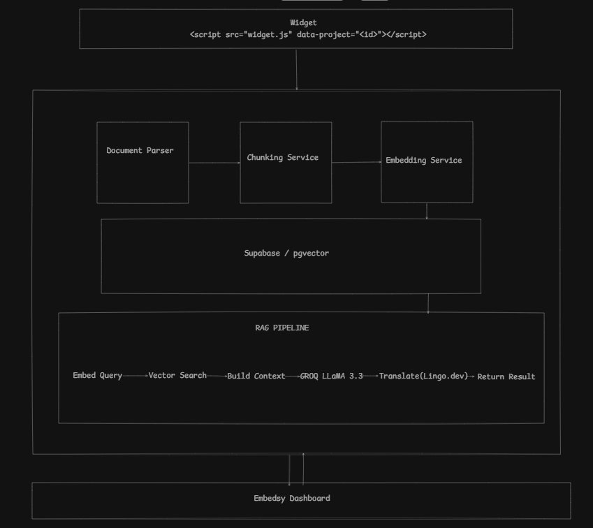

# Embedsy

**Stop rebuilding the RAG pipeline. Plug it in, upload your docs, ship the chatbot.**

Every developer, freelancer, or indie hacker building a docs-aware chatbot ends up doing the same work: wire up a vector DB, figure out chunking, hook in an LLM, handle streaming, add a UI. Embedsy does all of that for you — as a complete, open pipeline you can drop into any React or Next.js project in under an hour.

Upload your docs → get a project ID → embed a fully functional, multilingual RAG chatbot directly in your app. No vendor lock-in, no rebuilding from scratch, no black-box platform eating your API budget.

And the part that most tools skip: **Embedsy speaks your users' language.** Multilingual support is built into the RAG pipeline itself — not a translation layer tacked on top. Your German users get German answers from your English docs, automatically, without you maintaining a second copy of anything.

---

## Table of Contents

1. [What Problem This Solves](#what-problem-this-solves)
2. [Architecture](#architecture)
3. [How the RAG Pipeline Works](#how-the-rag-pipeline-works)
4. [Project Structure](#project-structure)
5. [Tech Stack](#tech-stack)
6. [Prerequisites](#prerequisites)
7. [Environment Variables](#environment-variables)
8. [Local Development Setup](#local-development-setup)
9. [Database Setup (Supabase)](#database-setup-supabase)
10. [API Reference](#api-reference)
11. [React & Next.js Integration](#react--nextjs-integration)
12. [Widget Configuration Options](#widget-configuration-options)
13. [Multilingual Support (Lingo.dev)](#multilingual-support-lingodev)
14. [Deployment](#deployment)
15. [Known Limitations & Design Decisions](#known-limitations--design-decisions)

---

## What Problem This Solves

If you've ever been hired to add a "chat with our docs" feature to a client's site, or tried building one for your own project, you know how much boilerplate it takes before you even get to the interesting parts:

- Set up a vector database and learn its query API
- Figure out how to chunk documents so context doesn't get cut off
- Pick an LLM, write the prompt, handle rate limits
- Build a chat UI that doesn't look like a prototype
- Handle errors, loading states, message persistence
- Do it all again for the next project

Embedsy is the reusable foundation that handles every one of those steps. You bring your docs and your project ID. Everything else is already built.

**For freelancers and contractors:** deliver a working AI chatbot feature in a fraction of the usual time. The entire pipeline — ingestion, retrieval, generation, translation — is already wired up. Your job is just integration.

**For indie hackers and side projects:** add intelligent doc search to your app without burning weeks on infrastructure. Runs entirely on free tiers.

**For teams:** own the code, read every line, extend any part of it. No SaaS dependency, no per-query pricing surprises.

---

## Architecture



Two distinct phases power the system:

**Ingestion — runs once per document upload**

Dashboard → Backend → Document Parser → Chunking Service → Embedding Service → Supabase/pgvector

**Query — runs on every user message from your React app**

React component → `POST /api/chat` → RAG Pipeline (embed → vector search → build context → Groq LLaMA 3.3 → Lingo.dev translate) → response back to component

The dashboard (React + Vite + TailwindCSS) handles project management and document uploads using Supabase JWT auth. Your React or Next.js app only ever talks to `/api/chat` — a public endpoint that validates the project API key inline. Everything is decoupled and independently deployable.

---

## How the RAG Pipeline Works

### Document Ingestion

When you upload a file via the dashboard:

**1. Parse** — `pdf-parse` extracts raw text from PDFs. `.txt` and `.md` files are decoded as UTF-8. Accepted types: `application/pdf`, `text/plain`, `text/markdown`. Max file size: 10 MB.

**2. Clean** — Excess whitespace is collapsed, newlines normalized, PDF extraction artifacts stripped.

**3. Chunk** — Text is split sentence-by-sentence on `[.!?]+`. Sentences are assembled into chunks up to **1,000 characters**, with a **200-character overlap** carried forward from the trailing sentences of the previous chunk. The overlap is intentional — it prevents answers from being severed right at a chunk boundary.

```js
// backend/src/config/constants.js
export const CHUNK_SIZE = 1000;
export const CHUNK_OVERLAP = 200;
export const EMBEDDING_DIMENSION = 384;
export const LLM_MODEL = 'llama-3.3-70b-versatile';
export const TOP_K_RESULTS = 5;
```

**4. Embed** — Each chunk is passed through a custom deterministic hash-based embedding function. Output is a 384-dimensional L2-normalized float vector. See the note in [Known Limitations](#known-limitations--design-decisions) for the upgrade path to a neural encoder.

**5. Store** — Chunks and their vectors are inserted into Supabase's `embeddings` table. A `match_embeddings` Postgres RPC function handles cosine similarity retrieval at query time.

### Query Processing

When a user sends a message from your React component:

**1. Embed the query** using the same hash function used at ingestion — consistency here is what makes cosine similarity meaningful.

**2. Vector search** — `match_embeddings(query_embedding, threshold=0.0, count=5, project_id)` returns the top-5 most similar stored chunks ranked by cosine similarity.

**3. Build context** — Retrieved chunks are numbered and concatenated:
```
[1] chunk text...

[2] chunk text...
```

**4. Generate answer in English** — Context + user question go to Groq's `llama-3.3-70b-versatile` with `temperature: 0.3`, `max_tokens: 500`. The system prompt strictly constrains the model to answer only from the provided context.

**5. Translate** — If the user has selected a non-English language, the English answer is passed through `lingoEngine.localizeText(answer, { sourceLocale: 'en', targetLocale: targetLanguage })`. If translation fails for any reason, the English answer is returned silently — no error surfaced to the user.

**6. Return** — `{ answer, sources[], confidence }` where `confidence` is the mean cosine similarity of the retrieved chunks as a 0–100 integer.

### Why the LLM always reasons in English

Keeping the LLM in English and translating the output — rather than translating the user's question first, or prompting in the target language — gives three concrete advantages:

- LLaMA performs measurably better in English than in other languages
- Your doc corpus doesn't need translated copies; one upload covers every language
- Lingo.dev's translation quality is higher on a clean English sentence than on a multilingual prompt chain

### A note on the embedding function

The current implementation is a **custom TF-IDF-style hash function**, not a neural sentence encoder. Words are lowercased, hashed to positions in a 384-dim vector with inverse-square-root positional weighting, then L2-normalized. It's fast, free, and has zero external dependencies.

The tradeoff: no semantic understanding. Paraphrase and synonym matching will be weak. Keyword-heavy documentation — API references, changelogs, FAQs — works well. To upgrade to semantic embeddings, replace `backend/src/services/embedding.js` with an OpenAI `text-embedding-3-small` call or a local `@xenova/transformers` model. The rest of the pipeline is completely unchanged.

---

## Project Structure

```
Embedsy/
├── backend/                        # Express.js API — the full RAG engine
│   └── src/
│       ├── config/
│       │   ├── constants.js        # CHUNK_SIZE, LLM_MODEL, EMBEDDING_DIMENSION
│       │   └── database.js         # Supabase public + admin (service role) clients
│       ├── middleware/
│       │   ├── auth.js             # requireAuth (JWT) + validateApiKey
│       │   ├── cors.js
│       │   └── error-handler.js
│       ├── routes/
│       │   ├── chat.js             # POST /api/chat — public, your React app hits this
│       │   ├── documents.js        # Upload / list / delete docs — auth required
│       │   └── projects.js         # Project CRUD + public /widget-config endpoint
│       └── services/
│           ├── chunking.js         # Sentence-aware chunking with overlap
│           ├── document-parser.js  # pdf-parse + plaintext
│           ├── embedding.js        # Hash-based 384-dim vector generation
│           ├── lingo.js            # Lingo.dev translation wrapper
│           ├── llm.js              # Groq SDK — LLaMA 3.3 70B
│           ├── rag.js              # Orchestrates the full RAG pipeline
│           └── vectordb.js         # Supabase insert + match_embeddings RPC
│
├── frontend/                       # React dashboard (Vite + TailwindCSS)
│   └── src/
│       ├── context/AuthContext.jsx # Supabase Auth session management
│       ├── hooks/                  # useProjects, useDocuments, useApi
│       └── pages/
│           ├── Dashboard.jsx       # Project list + stats
│           ├── ProjectDetail.jsx
│           ├── Upload.jsx          # Document upload UI
│           └── Embed.jsx           # Embed code generator + live preview
│
├── widget/                         # The embeddable React component
│   └── src/
│       ├── index.jsx               # Bootstrap + window.Embedsy.init
│       ├── App.jsx                 # Root — language state, open/close, messages
│       ├── components/
│       │   ├── ChatBubble.jsx
│       │   ├── ChatWindow.jsx
│       │   ├── Message.jsx
│       │   ├── SourceCitation.jsx  # Shows how many doc chunks backed the answer
│       │   └── TypingIndicator.jsx
│       ├── hooks/
│       │   ├── useChat.js          # Message sending, loading/error state
│       │   └── useMessages.js      # History management + localStorage (24hr TTL)
│       └── utils/storage.js        # localStorage persistence helpers
│
├── examples/
│   ├── react-app/                  # Vite React integration example
│   ├── nextjs-app/                 # Next.js App Router integration example
│   ├── vue-app/
│   └── vanilla-html/
│
└── packages/react/                 # (WIP) publishable npm package wrapper
```

---

## Tech Stack

| Layer | Technology |
|---|---|
| Backend | Node.js (ESM), Express 4 |
| LLM | Groq SDK → `llama-3.3-70b-versatile` |
| Vector DB | Supabase (Postgres + pgvector) |
| Auth | Supabase Auth (JWT) |
| Translation | Lingo.dev SDK (`lingo.dev/sdk`) |
| Document parsing | `pdf-parse`, UTF-8 plaintext/markdown |
| Dashboard | React 18, Vite 5, TailwindCSS 3, React Router v6 |
| Widget build | Vite lib mode → single IIFE (`widget.js`) for non-React sites |
| File uploads | Multer (memory storage, 10 MB limit) |

Everything on this stack has a free tier. You can run a production Embedsy deployment at zero cost.

---

## Prerequisites

- **Node.js** ≥ 18.x
- **npm** ≥ 9.x
- A **Supabase** project — [supabase.com](https://supabase.com) (free tier works)
- A **Groq** API key — [console.groq.com](https://console.groq.com) (free tier works)
- A **Lingo.dev** API key — [lingo.dev](https://lingo.dev) (optional — only needed for multilingual responses)

---

## Environment Variables

### Backend (`backend/.env`)

```env
# Supabase
SUPABASE_URL=https://your-project.supabase.co
SUPABASE_KEY=your-supabase-anon-key
SUPABASE_SERVICE_KEY=your-supabase-service-role-key

# Groq
GROQ_API_KEY=your-groq-api-key

# Lingo.dev — omit entirely to disable translation; English always works without it
LINGODOTDEV_API_KEY=your-lingo-api-key

# Server
PORT=3000
```

`SUPABASE_SERVICE_KEY` is the service role key. It bypasses Row Level Security and is used **only** server-side inside the backend. Never expose it to any client.

### Frontend (`frontend/.env`)

```env
VITE_SUPABASE_URL=https://your-project.supabase.co
VITE_SUPABASE_ANON_KEY=your-supabase-anon-key
VITE_API_URL=http://localhost:3000/api
```

### Widget (`widget/.env`)

```env
VITE_API_URL=http://localhost:3000/api
```

In production, `VITE_API_URL` must point to your deployed backend before building. The URL is baked into the compiled bundle at build time.

---

## Local Development Setup

```bash
git clone https://github.com/your-org/embedsy.git
cd embedsy
```

### 1. Backend

```bash
cd backend
npm install
cp .env.example .env   # add your credentials
npm run dev            # nodemon — restarts on every file change
```

Verify it's running:
```bash
curl http://localhost:3000/health
# { "status": "ok", "version": "1.0.0" }
```

### 2. Dashboard

```bash
cd frontend
npm install
cp .env.example .env
npm run dev            # http://localhost:5174
```

### 3. Widget dev server

```bash
cd widget
npm install
cp .env.example .env
npm run dev            # http://localhost:5173
```

To test the compiled production bundle:

```bash
cd widget && npm run build
# dist/widget.js — the single-file IIFE for non-React sites
```

---

## Database Setup (Supabase)

### Enable pgvector

Run this first in your Supabase SQL editor:

```sql
create extension if not exists vector;
```

### Table: `projects`

```sql
create table projects (
  id           uuid primary key default gen_random_uuid(),
  name         text not null,
  api_key      text not null unique,
  widget_title text,
  theme_color  text default '#00FF87',
  user_id      uuid references auth.users(id) on delete cascade,
  created_at   timestamptz default now()
);
```

### Table: `embeddings`

```sql
create table embeddings (
  id          bigserial primary key,
  project_id  uuid references projects(id) on delete cascade,
  chunk_text  text not null,
  embedding   vector(384),
  metadata    jsonb,
  created_at  timestamptz default now()
);

-- IVFFlat index for fast approximate nearest-neighbor search
create index on embeddings using ivfflat (embedding vector_cosine_ops)
  with (lists = 100);
```

### RPC: `match_embeddings`

This function runs on every user query. Create it in the Supabase SQL editor:

```sql
create or replace function match_embeddings(
  query_embedding  text,
  match_threshold  float,
  match_count      int,
  project_id       uuid
)
returns table (
  id          bigint,
  chunk_text  text,
  metadata    jsonb,
  similarity  float
)
language sql stable
as $$
  select
    e.id,
    e.chunk_text,
    e.metadata,
    1 - (e.embedding <=> query_embedding::vector) as similarity
  from embeddings e
  where e.project_id = match_embeddings.project_id
    and 1 - (e.embedding <=> query_embedding::vector) > match_threshold
  order by e.embedding <=> query_embedding::vector
  limit match_count;
$$;
```

### Row Level Security

```sql
alter table projects enable row level security;
alter table embeddings enable row level security;

create policy "Users see own projects"
  on projects for all
  using (user_id = auth.uid());
```

The backend uses the service role key which bypasses RLS. These policies protect against direct Supabase client access from the browser.

---

## API Reference

All endpoints are prefixed `/api`. In production, the base URL is wherever you deploy the backend.

---

### `GET /health`

Public. Returns server status.

```json
{ "status": "ok", "timestamp": "2025-01-01T00:00:00.000Z", "version": "1.0.0" }
```

---

### `POST /api/chat`

**Public.** The only endpoint your React component needs to talk to.

**Request body**
```json
{
  "projectId": "uuid",
  "message": "How do I reset my password?",
  "apiKey": "embedsy_abc123...",
  "targetLanguage": "de"
}
```

| Field | Type | Required | Description |
|---|---|---|---|
| `projectId` | string (UUID) | ✅ | The project whose doc corpus to search |
| `message` | string | ✅ | The user's question |
| `apiKey` | string | ✅ | Project API key (`embedsy_...`) |
| `targetLanguage` | string | ❌ | BCP 47 locale — `"de"`, `"fr"`, `"ja"`, etc. Defaults to `"en"`. Triggers translation when non-English. |

**Response**
```json
{
  "success": true,
  "answer": "Um Ihr Passwort zurückzusetzen, navigieren Sie zur Anmeldeseite...",
  "sources": [
    { "id": 1, "text": "Navigate to the login page and click 'Forgot password'...", "similarity": 87 },
    { "id": 2, "text": "An email will be sent to your registered address...", "similarity": 74 }
  ],
  "confidence": 80,
  "timestamp": "2025-01-01T00:00:00.000Z"
}
```

`confidence` is average cosine similarity of retrieved chunks as a 0–100 integer. `sources` always contains the original English text regardless of `targetLanguage`.

---

### `GET /api/projects/:id/widget-config`

**Public.** Resolves project metadata from just a project ID. Called automatically by the widget on mount.

```json
{
  "success": true,
  "projectId": "uuid",
  "apiKey": "embedsy_abc123...",
  "title": "Ask our docs",
  "themeColor": "#00FF87"
}
```

---

### `POST /api/projects`

**Auth required** (`Authorization: Bearer <supabase-jwt>`)

Generates a UUID project ID and an `embedsy_`-prefixed API key automatically.

```json
// request
{ "name": "My Docs Bot", "widgetTitle": "Ask our docs", "themeColor": "#6366f1" }

// response 201
{ "success": true, "project": { "id": "uuid", "name": "My Docs Bot", "api_key": "embedsy_...", ... } }
```

---

### `GET /api/projects` · `GET /api/projects/:id` · `DELETE /api/projects/:id`

**Auth required.** Standard CRUD. The list endpoint includes chunk counts per project.

---

### `POST /api/projects/:projectId/upload`

**Auth required.** `Content-Type: multipart/form-data`

| Field | Description |
|---|---|
| `file` | `application/pdf`, `text/plain`, or `text/markdown`. Max 10 MB. |

```json
{
  "success": true,
  "stats": { "filename": "guide.pdf", "fileSize": 204800, "chunks": 47, "textLength": 42301 }
}
```

---

### `GET /api/projects/:projectId/documents`

**Auth required.** Returns documents grouped by filename with chunk counts.

---

### `DELETE /api/projects/:projectId/documents/:filename`

**Auth required.** Deletes all embedding chunks for the given filename (URL-encoded).

---

## React & Next.js Integration

This is the primary way to use Embedsy. The widget is a React component — it lives inside your component tree, gets your styles, and participates in your app's state. No iframes, no foreign scripts loaded into your DOM.

### React (Vite / CRA)

Copy `widget/src/` into your project, then import the hooks and components directly:

```jsx
// src/components/DocsChat.jsx
import { useState } from 'react';
import ChatWindow from '../embedsy/components/ChatWindow';
import { useMessages } from '../embedsy/hooks/useMessages';
import { useChat } from '../embedsy/hooks/useChat';

const PROJECT_ID = import.meta.env.VITE_EMBEDSY_PROJECT_ID;
const API_KEY    = import.meta.env.VITE_EMBEDSY_API_KEY;

export default function DocsChat() {
  const [language, setLanguage] = useState('en');
  const { messages, addMessage, clearAllMessages } = useMessages(PROJECT_ID);

  const { send, isLoading, error } = useChat(
    PROJECT_ID,
    API_KEY,
    language,
    (response) => addMessage({
      role: 'bot',
      content: response.answer,
      sources: response.sources,
      confidence: response.confidence,
    })
  );

  const handleSend = async (message) => {
    addMessage({ role: 'user', content: message });
    await send(message);
  };

  return (
    <div className="fixed bottom-6 right-6 z-50">
      <ChatWindow
        messages={messages}
        isLoading={isLoading}
        error={error}
        onSend={handleSend}
        onClear={clearAllMessages}
        title="Ask our docs"
        selectedLanguage={language}
        onLanguageChange={(lang) => { setLanguage(lang); clearAllMessages(); }}
      />
    </div>
  );
}
```

```env
# .env
VITE_EMBEDSY_PROJECT_ID=your-project-uuid
VITE_EMBEDSY_API_KEY=embedsy_abc123...
VITE_API_URL=https://api.yourdomain.com/api
```

---

### Next.js (App Router)

Mark the component `'use client'` — the chat hooks use `localStorage` and `fetch`, which are browser APIs. Everything else is identical to the React setup.

```tsx
// app/components/DocsChat.tsx
'use client';

import { useState } from 'react';
import { useMessages } from '@/embedsy/hooks/useMessages';
import { useChat } from '@/embedsy/hooks/useChat';
import ChatWindow from '@/embedsy/components/ChatWindow';

const PROJECT_ID = process.env.NEXT_PUBLIC_EMBEDSY_PROJECT_ID!;
const API_KEY    = process.env.NEXT_PUBLIC_EMBEDSY_API_KEY!;

export default function DocsChat() {
  const [language, setLanguage] = useState('en');
  const { messages, addMessage, clearAllMessages } = useMessages(PROJECT_ID);

  const { send, isLoading, error } = useChat(
    PROJECT_ID,
    API_KEY,
    language,
    (res) => addMessage({
      role: 'bot',
      content: res.answer,
      sources: res.sources,
      confidence: res.confidence,
    })
  );

  const handleSend = async (msg: string) => {
    addMessage({ role: 'user', content: msg });
    await send(msg);
  };

  return (
    <ChatWindow
      messages={messages}
      isLoading={isLoading}
      error={error}
      onSend={handleSend}
      onClear={clearAllMessages}
      title="Ask our docs"
      selectedLanguage={language}
      onLanguageChange={(lang) => { setLanguage(lang); clearAllMessages(); }}
    />
  );
}
```

Add it to your root layout to make it available across every page:

```tsx
// app/layout.tsx
import DocsChat from './components/DocsChat';

export default function RootLayout({ children }: { children: React.ReactNode }) {
  return (
    <html lang="en">
      <body>
        {children}
        <DocsChat />
      </body>
    </html>
  );
}
```

```env
# .env.local
NEXT_PUBLIC_EMBEDSY_PROJECT_ID=your-project-uuid
NEXT_PUBLIC_EMBEDSY_API_KEY=embedsy_abc123...
NEXT_PUBLIC_EMBEDSY_API_URL=https://api.yourdomain.com/api
```

`NEXT_PUBLIC_` prefix is required — these are read in a client component and must be exposed to the browser bundle.

---

### Calling the API directly (bring your own UI)

Don't want to use the pre-built components? Just hit the endpoint and build whatever UI you want:

```ts
// lib/embedsy.ts
type EmbedasyResponse = { answer: string; sources: Source[]; confidence: number };

export async function askDocs(question: string, language = 'en'): Promise<EmbedasyResponse> {
  const res = await fetch(`${process.env.NEXT_PUBLIC_EMBEDSY_API_URL}/chat`, {
    method: 'POST',
    headers: { 'Content-Type': 'application/json' },
    body: JSON.stringify({
      projectId: process.env.NEXT_PUBLIC_EMBEDSY_PROJECT_ID,
      message: question,
      apiKey: process.env.NEXT_PUBLIC_EMBEDSY_API_KEY,
      targetLanguage: language,
    }),
  });

  if (!res.ok) throw new Error('Chat request failed');
  return res.json();
}
```

---

## Widget Configuration Options

| Prop | Type | Default | Description |
|---|---|---|---|
| `projectId` | string | — | **Required.** Your project UUID from the dashboard. |
| `apiKey` | string | — | **Required.** Your project API key (`embedsy_...`). |
| `title` | string | Project name from DB | Header text inside the chat window. |
| `position` | `bottom-right` \| `bottom-left` | `bottom-right` | Position of the floating bubble on screen. |
| `themeColor` | hex string | `#00FF87` | Accent color — applied as `--embedsy-theme` CSS custom property. Controls bubble, send button, and active highlights. |

### What's included in the chat UI out of the box

- **Language picker** in the chat header — users select their language and all subsequent responses arrive translated. Switching language clears the conversation to prevent mixed-language context.
- **Message persistence** via `localStorage` under `embedsy_messages_{projectId}`, with automatic 24-hour expiry.
- **Source citations** on every bot response — shows how many documentation chunks were used to generate the answer.
- **Typing indicator** while waiting for the backend.
- **Inline error + retry button** that replays the last user message on failure.

---

## Multilingual Support (Lingo.dev)

This is the part most doc chatbots don't have. Here's exactly what happens when a non-English user asks a question:

```
User types in German
        │
        ▼
POST /api/chat → { message: "Wie setze ich mein Passwort zurück?", targetLanguage: "de" }
        │
        ▼
Query is embedded as-is — hash embeddings are language-agnostic
        │
        ▼
Vector search retrieves top-5 chunks from your English documentation
        │
        ▼
Groq LLaMA 3.3 generates a clean answer in English
        │
        ▼
Lingo.dev translates: localizeText(answer, { sourceLocale: 'en', targetLocale: 'de' })
        │
        ▼
"Um Ihr Passwort zurückzusetzen, navigieren Sie zur Anmeldeseite..."
```

**Why not translate the question to English first?** That approach adds a second network call and a second point of failure before you even touch your docs. Embedsy's hash-based embeddings are language-agnostic at the character level, so the query can be in any language and still retrieve the right English chunks. Translation only happens once, at the very end, on a clean English string.

**Graceful degradation:** If `LINGODOTDEV_API_KEY` is missing or Lingo.dev is unavailable, the original English answer is returned silently. No error is thrown, no user-facing failure. You can get the whole project running and add multilingual support later with a single environment variable.

**Supported locales:** Any BCP 47 locale supported by Lingo.dev — `fr`, `de`, `es`, `pt`, `it`, `ja`, `zh`, `ko`, `ar`, `hi`, and many more.

---

## Deployment

Each of the three components deploys independently.

| Component | Recommended platform | Notes |
|---|---|---|
| Backend | Railway / Render / Fly.io | Set all env vars on the platform. Start command: `node src/index.js` |
| Dashboard | Vercel / Netlify | Set `VITE_*` as build-time env vars. Deploy the `frontend/` directory. |
| Widget (compiled) | Vercel / Cloudflare / S3 + CDN | Build with `VITE_API_URL` baked in. Only needed for non-React sites. |

For React and Next.js apps, deploy the component source directly inside your project — no separate widget deployment needed.

### Backend

```bash
cd backend
npm start   # set env vars on your platform's dashboard
```

### Dashboard

```bash
cd frontend
VITE_API_URL=https://api.yourdomain.com/api npm run build
# deploy dist/ to Vercel or Netlify
```

> **CORS:** Before deploying, configure `backend/src/middleware/cors.js` to allow requests from your app's domain. The backend needs to accept cross-origin requests from wherever your React component is hosted.

---

## Known Limitations & Design Decisions

**Hash embeddings have no semantic understanding.** Paraphrase and synonym matching will be weak — two sentences that mean the same thing but use different words won't match. This is a deliberate starting point that requires no external API or model. To upgrade, replace `backend/src/services/embedding.js` with an OpenAI `text-embedding-3-small` call or a local `@xenova/transformers` model. Everything else in the pipeline stays the same.

**Embeddings stored as serialized text strings.** Vectors are inserted as `[0.1,0.2,...]` and cast to `vector` inside the `match_embeddings` RPC. Functional, but not as efficient as native pgvector array input. A future version should use pgvector's native binding.

**No streaming responses.** The `/api/chat` endpoint waits for the full Groq completion before responding. Groq's SDK supports streaming — adding it to `llm.js` and the chat route would noticeably cut perceived latency on longer answers.

**Chat endpoint API key not enforced server-side.** `validateApiKey` middleware exists in `auth.js` but is not currently wired to the chat route. Any caller with a valid `projectId` can query any project's corpus. Wiring the middleware in `chat.js` is a one-line fix.

**Widget bundle size for React apps.** The IIFE build inlines React and ReactDOM (~150–200 KB gzipped). If you're already running React 18 in your app, use the component source directly and share the host app's React instance — don't use the compiled bundle.

---

## Contributing

If you've used Embedsy to ship something, found a bug, or have an idea for the pipeline — PRs and issues are welcome. The codebase is intentionally straightforward so it's easy to jump in anywhere.

---

Made with ❤️ by [SHETTYKSIDDHARTH](https://github.com/SHETTYKSIDDHARTH)

If this saved you time on a project, give it a ⭐ — it helps others find it.